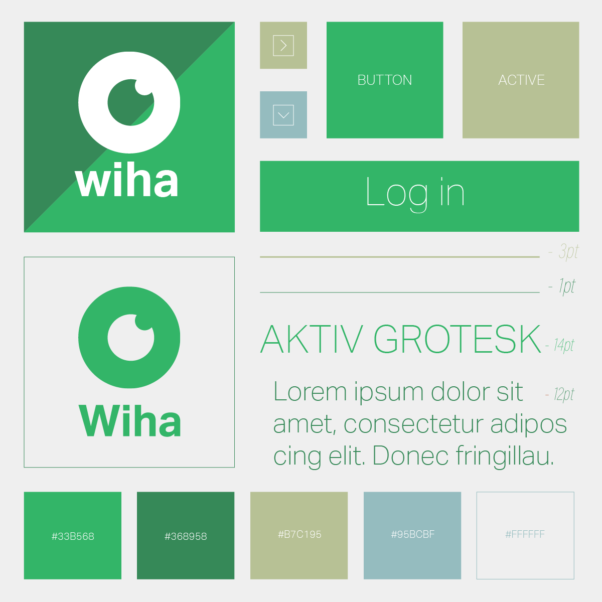
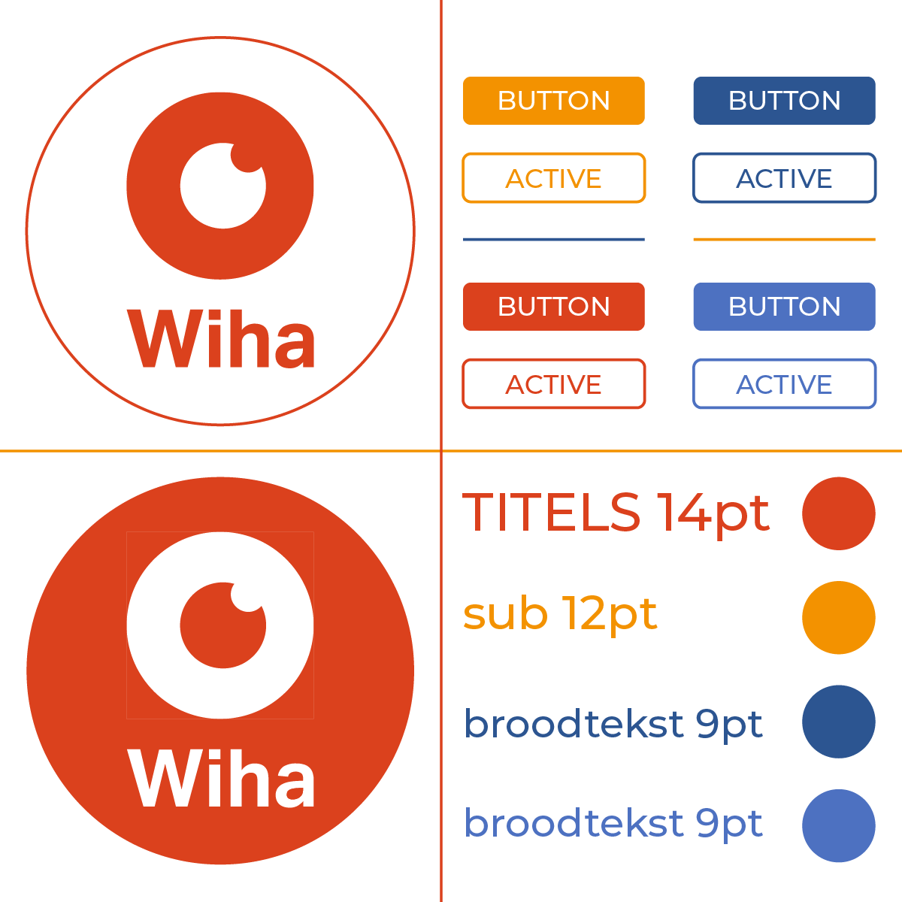
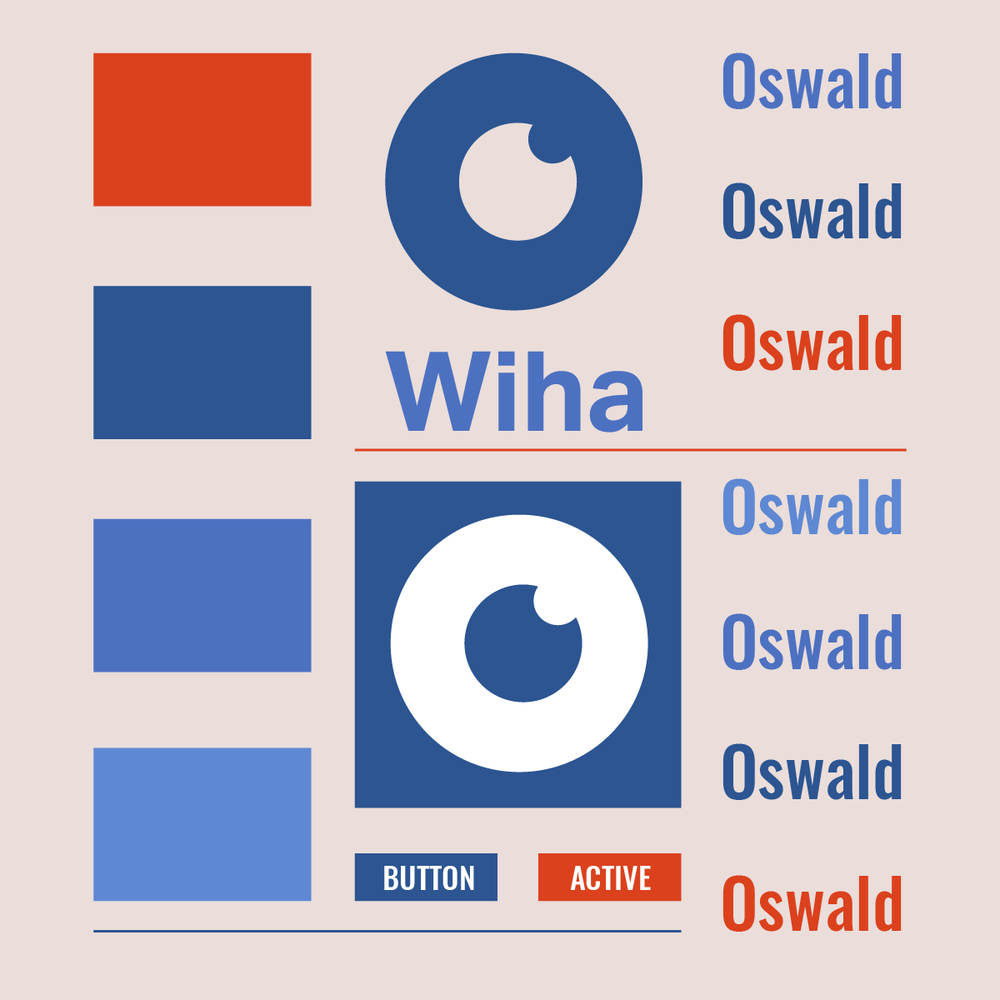

We kozen voor een strakke, cleane en afgelijnde stijl die simpel en duidelijk is voor iedereen binnen onze doelgroep.

We gebruikten groene tinten als hoofdleuren en lichtbruine en blauwe tinten als accentkleuren. Dit om het natuurlijke imago van de verschillende parken en domeinen in België te benadrukken.
 

Om de strakke stijl te beklemtonen werken we met het lettertype aktiv grotesk, dat perfect aanleund bij de rest van de stijl.

Ook voor de buttons en iconen gebruiken we deze vormtaal en worden ze hoekig en rechtlijnig afgebeeld.

## Gekozen

## Alternatief A

## Alternatief B

## Alternatief C

